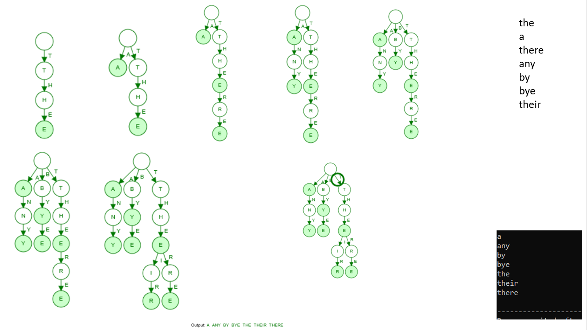

# ADATrabajos

## TRIE 📌
Los jugadores tienen que mover una joya para juntar tres o más joyas adyacentes del mismo color. Cuando esto ocurre, las joyas desaparecen y un nuevo grupo de gemas se generan aleatoriamente desde arriba para llenar el espacio vacío. A veces, se forman combinaciones automáticas, creando una cadena conocida como cascada. 
El juego termina cuando no hay mas movimientos posibles.

  

